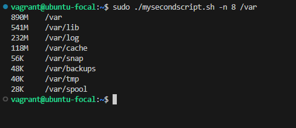
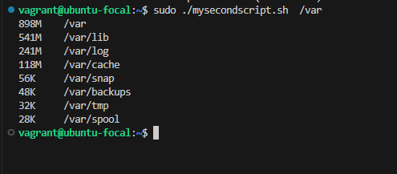
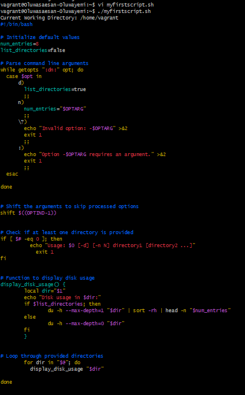
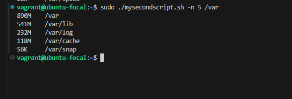

# ALTSCHOOL Live Class Assignment

## Oluwasesan Oluwadunni Oluwayemi

## 1. Write a shell script that checks the disk usage in a given directory. the script can take two optional arguments and one compulsory argument...
### -d: which means that all files and directory within the specified directory or directories should be listed.

### -n: which means that the top N entries should be returned.

### list of directories: this will be the directories you want to check it's disk usage

### e.g. yourscript.sh -n 5 /var should return the top 5 directories wrt disk usage in /var directory

## 2. Create a backup script. This script creates a backup of a given directory and saves it in another directory with a timestamp. It takes two arguments: the source directory and the destination directory 
### Note: The backup should be a tar archive

