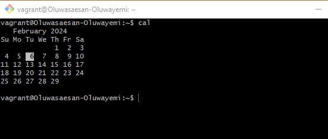
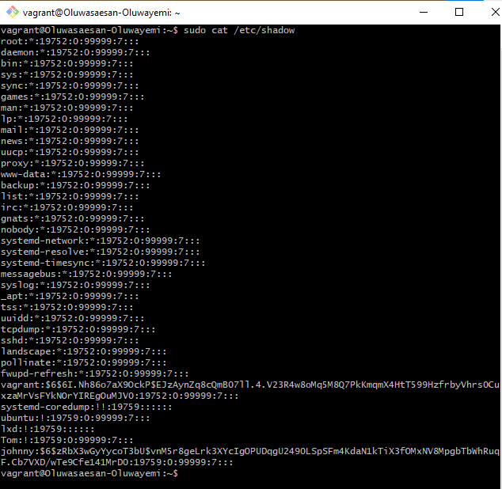
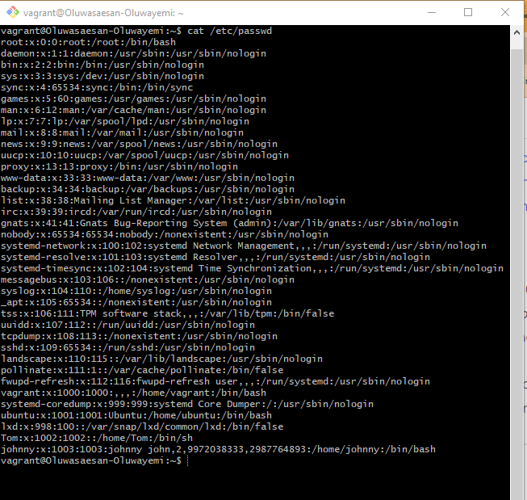
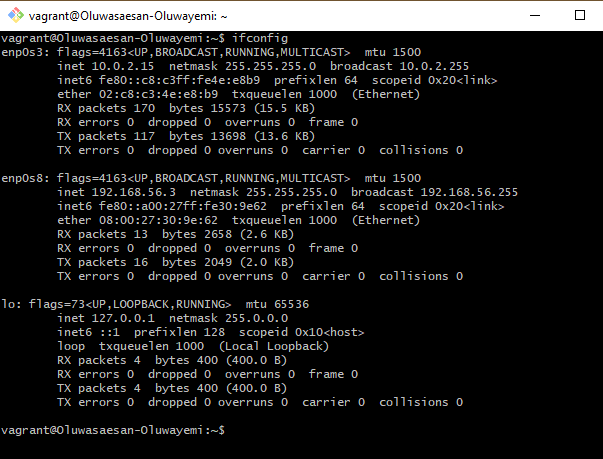
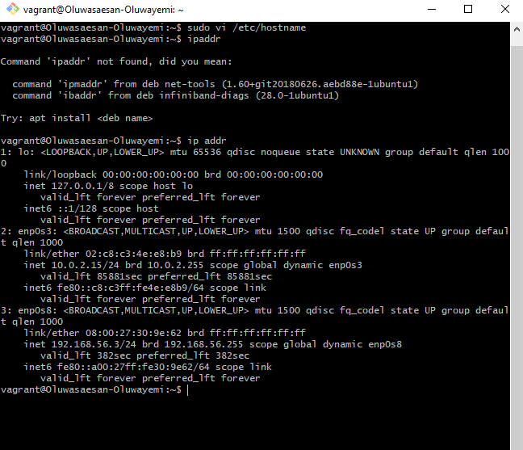
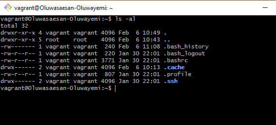
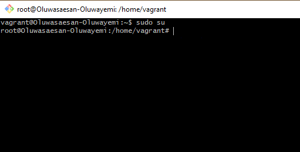
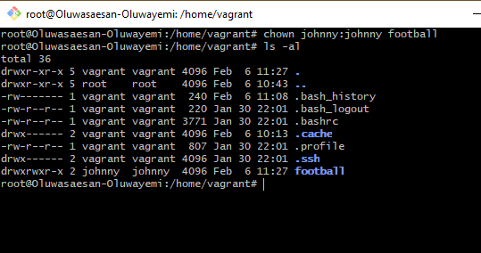
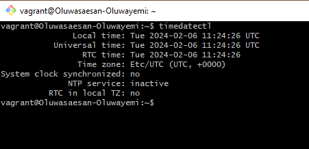
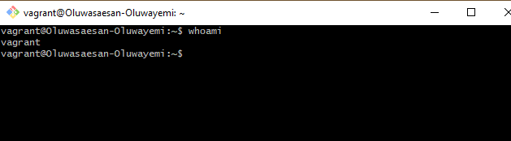

# My Ten Linux Command 

2. `cal command` 

3. `cat passwd command` 

4. `cat users command` 

5. `ifconfig command` 

6. `IP address command` 

7. `list hidden files command`  

8. `switch root user command` 

9. `switch dir owner command` 

10. `timezone command` 

11. `whoami command` 

