# ALTSCHOOL Live Class Assignment

## Oluwasesan Oluwayemi

## Your login name: altschool i.e., home directory /home/altschool. The home directory contains the following sub-directories: code, tests, personal, misc unless otherwise specified, you are running commands from the home directory.

`make home dir`
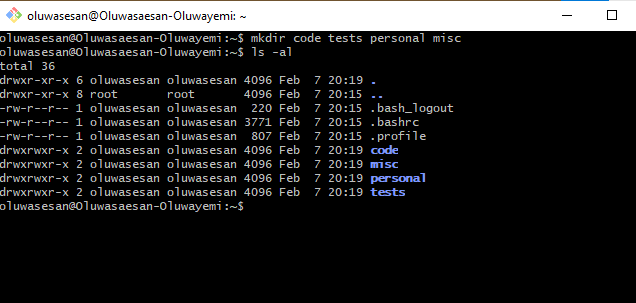

A.	`Change directory to the tests directory using absolute pathname`

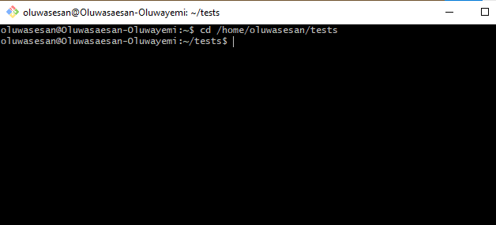

B.	`Change directory to the tests directory using relative pathname`

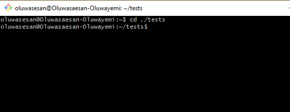

C.	`Use echo command to create a file named fileA with text content ‘Hello A’ in the misc directory`

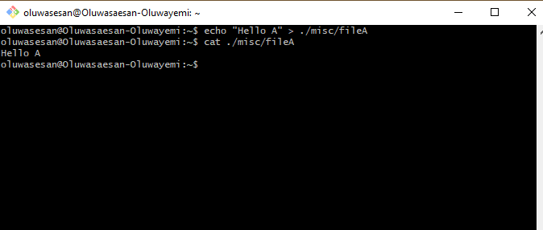

D.	`Create an empty file named fileB in the misc directory. Populate the file with a dummy content afterwards`

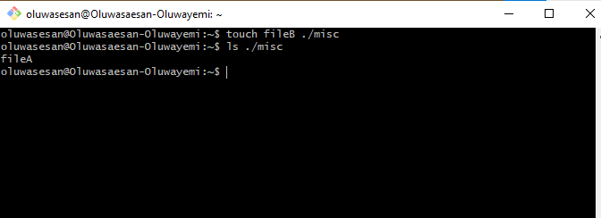

E.	`Copy contents of fileA into fileC`

F.	`Move contents of fileB into fileD`

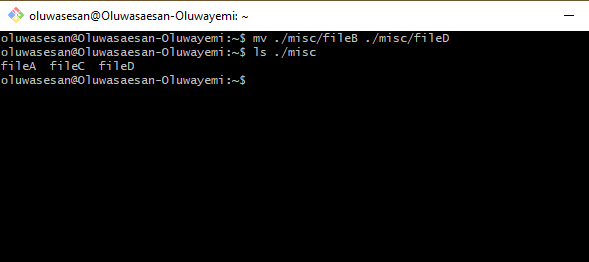

G.	`Create a tar archive called misc.tar for the contents of misc directory`

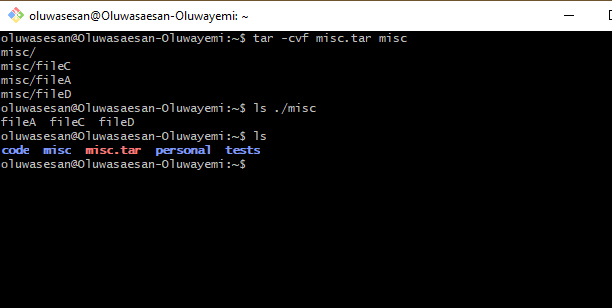

H.	`Compress the tar archive to create a misc.tar.gz file`

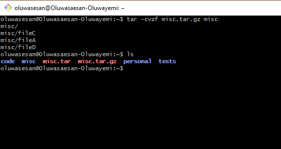

I.	`Create a user and force the user to change his/her password upon login`

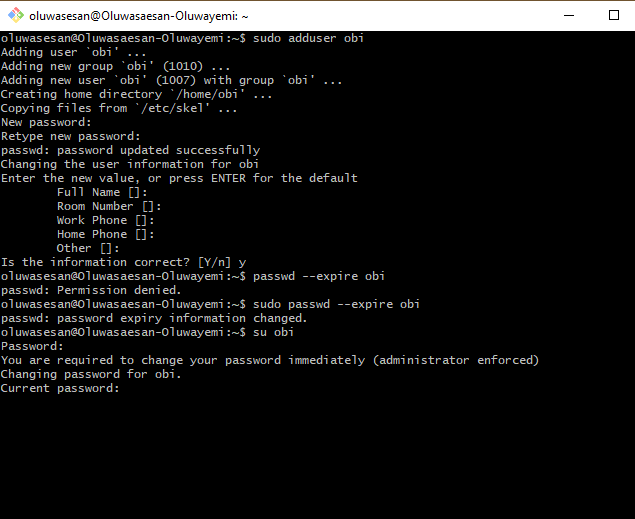

J.	`Lock a users password`

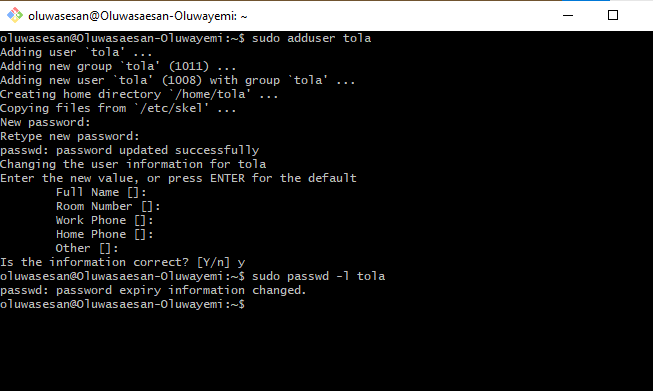

K.	`Create a user with no login shell`

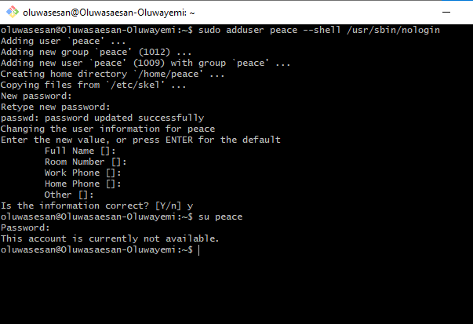

L.	`Disable password based authentication for ssh`

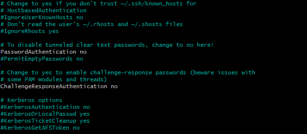

M.	`Disable root login for ssh`

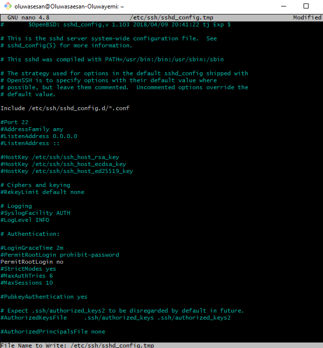

## Mode of submission:
you are going to push the required commands to your github repositories.

# Deadline: 10th Feb 2024
